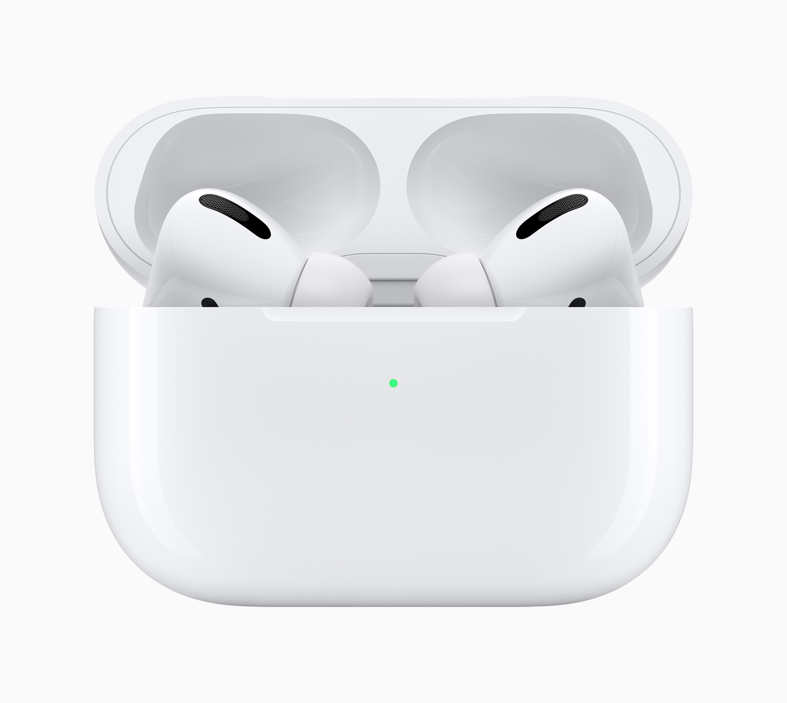
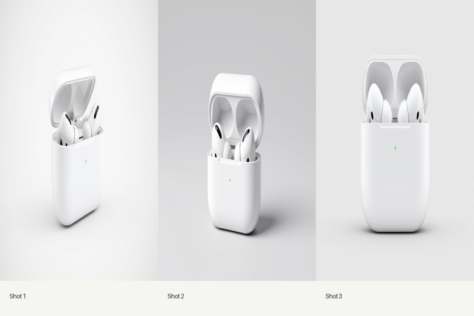
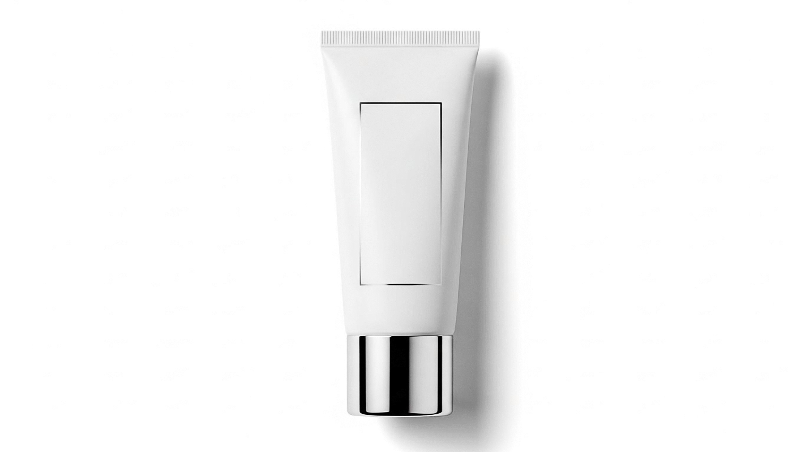
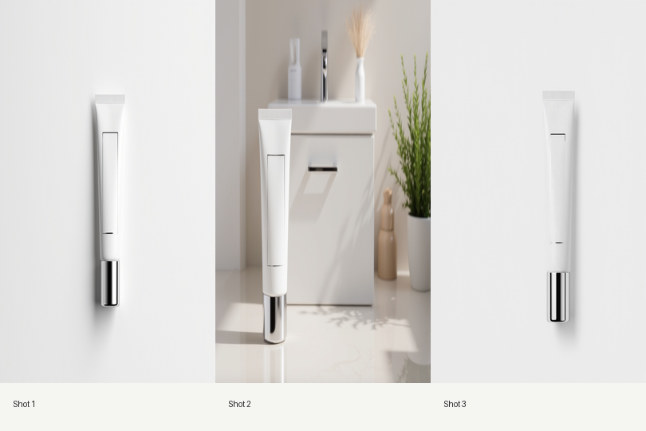

# AdPilot

[](LICENSE)

AdPilot turns a clean product reference image into a short, audited product-ad video. It uses Qwen2.5-VL for product analysis and visual review, FLUX.1 Kontext for reference-conditioned keyframes, and Wan2.2 I2V for motion.

## Demos

### Wireless Earbuds

<table>
  <tr><th width="30%">Reference image</th><th width="70%">Generated storyboard</th></tr>
  <tr>
    <td></td>
    <td></td>
  </tr>
</table>


[Watch the full video](assets/demo/wireless-earbuds/final_video.mp4)

### Cosmetic Tube

<table>
  <tr><th width="30%">Reference image</th><th width="70%">Generated storyboard</th></tr>
  <tr>
    <td></td>
    <td></td>
  </tr>
</table>


[Watch the full video](assets/demo/cosmetic-tube/final_video.mp4)

## Pipeline

1. Qwen2.5-VL extracts visible product cues and plans three advertising shots.
2. FLUX.1 Kontext generates reference-conditioned keyframe candidates.
3. Qwen2.5-VL audits explicit identity checks and comparatively ranks keyframe candidates against the reference.
4. Wan2.2 I2V generates video candidates, followed by a temporal consistency audit.
5. A failed shot receives one critic-guided regeneration attempt and a fresh audit; unresolved failures remain visible in `repair_log.json`.

`front_lock` is used for the included one-image demos.

## Setup

```bash
conda create -n adpilot python=3.11
conda activate adpilot
python -m pip install -r requirements.txt
```

On a machine with Hugging Face access, accept the FLUX.1 Kontext licence, run `hf auth login`, then download the required models:

```bash
bash scripts/download_models.sh
```

## Run an Agent Project

The interactive agent keeps each project in `projects/YYYYMMDD_product-name/` with its input assets, revision history, state checkpoint, audit records, storyboard, and final video.

Each included demo has a product-specific configuration script. Edit the configuration at the top of one, then run it:

```bash
bash scripts/run_wireless_earbuds.sh
# or
bash scripts/run_cosmetic_tube.sh
```

Set `MODE="guided"` to approve the storyboard before video generation, or `MODE="auto"` for automatic execution. Edit the structured product fields and `PROMPT` together for a new product. It also accepts optional extra product views through `REFERENCE_IMAGES`; set `PROJECT_NAME` when you want a cleaner label than the image filename.

You can also invoke `guided` mode directly:

```bash
python -m adpilot.agent chat \
  --product path/to/product.png \
  --brand "Example Brand" \
  --prompt "A luminous, editorial skincare launch with glass reflections and a calm morning mood" \
  --platform landscape
```

In `guided` mode, the process stays open and presents an `adpilot>` prompt when the storyboard is ready. Enter one of these actions there:

```text
approve
select shot_02 2
feedback shot_02 "Make the light warmer and keep the bottle larger in frame."
add-reference path/to/second-product-view.png
cancel
```

`auto` mode runs the same bounded generation-and-repair workflow without the normal storyboard approval pause. It asks for input only after a failed stage reaches its configured attempt limit, then prints a ready-to-run command that resumes the saved project from the shell:

```bash
python -m adpilot.agent create \
  --product path/to/product.png \
  --brand "Example Brand" \
  --prompt "Dynamic premium beverage campaign with fresh condensation and bright daylight" \
  --mode auto
python -m adpilot.agent run project_xxxxxxxxxx
```

Use `python -m adpilot.agent status project_xxxxxxxxxx` to inspect a project, or `python -m adpilot.agent --help` for the full command list. Pass `--model-root path/to/models` to `create` or `chat` when your model directory is elsewhere.

## Repository Layout

- `adpilot/agent/`: LangGraph-based auto and guided orchestration
- `adpilot/`: planning, generation, identity, audit, reporting, and creative modules
- `scripts/download_models.sh`: model setup utility
- `assets/demo/`: README demo media
- `examples/`: public reference images for the two included demos
- `tests/`: focused unit tests

## License

The source code is released under the [MIT License](LICENSE). Demo media and model weights remain subject to their respective terms.
